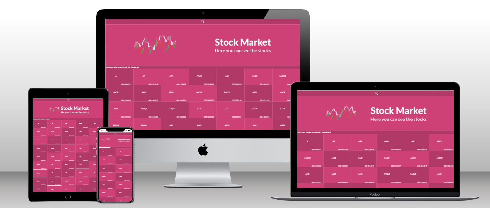

   

# Market stocks app

# 📗 Table of Contents

- [📖 About the project](#about-project)
  - [🛠 Built with](#built-with)
    - [Tech stack](#tech-stack)
    - [Key features](#key-features)
  - [🚀 Live demo](#live-demo)
- [💻 Getting started](#getting-started)
  - [Setup](#setup)
  - [Prerequisites](#prerequisites)
  - [Install](#install)
  - [Usage](#usage)
  - [Run tests](#run-tests)
  - [Deployment](#deployment)
- [👷‍👷‍♀️ Authors](#authors)
- [🔭 Future features](#future-features)
- [🤝 Contributing](#contributing)
- [⭐️ Show your support](#support)
- [🙏 Acknowledgements](#acknowledgements)
- [📝 License](#license)

# 📖 About the project 

This project is a web and mobile application that takes inspiration from the design of Nelson Sawka. It consists of two pages: the home page and the detail page. The home page showcases a selection of stocks from the Stock Market Exchange, each represented by its symbol (e.g., AAPL for APPLE Inc). Additionally, it displays the company's CIK as a numerical value, which serves as the registration number of the company before the SEC. The data used in the application is obtained from the Polygon API documentation (available at https://polygon.io/docs/stocks/get_v1_indicators_rsi__stockticker).

The application is developed using React.js and Redux, which enables efficient state management. Moving to the detail page, when a user clicks on one of the displayed items, they are presented with comprehensive information about the selected stock. This information includes details like the company's city, state, type of market, and total number of employees. The data for the detail page is fetched from another API provided by Polygon, specifically designed to retrieve data for the selected item. To facilitate the retrieval and storage of this information, Redux is utilized as a central store.

This project is a Single Page Application (SPA), which utilizes modern web technologies to provide a seamless and fluid user experience. By leveraging client-side rendering, the application eliminates the need for full page reloads, enabling users to navigate within the page smoothly.

## 🛠 Built with 

### Tech stack 

  
Languages and technologies
 
  <ul>
    <li><a href="#">React.js</a></li>
  </ul>
  <ul>
    <li><a href="#">Redux</a></li>
  </ul>
  <ul>
    <li><a href="#">JavaScript</a></li>
  </ul>
  <ul>
    <li><a href="#">HTML5</a></li>
  </ul>
  <ul>
    <li><a href="#">CSS3</a></li>
  </ul>
  <ul>
    <li><a href="#">Git</a></li>
  </ul>
  <ul>
    <li><a href="#">Jest</a></li>
  </ul>
  <ul>
    <li><a href="#">React-testing-library</a></li>
  </ul>

### Key features 

- **[Centralized state]**
- **[REST API]**
- **[Single Page Application]**

(<a href="#readme-top">back to top</a>)

## 🚀 Live demo 

 [Live Demo Link](https://venerable-sprinkles-b40b30.netlify.app) 

loom Video : https://www.loom.com/share/2600f52416f84137ab1873b77db989db

(<a href="#readme-top">back to top</a>)

## 💻 Getting started 

To get a local copy up and running, follow these steps.

### Prerequisites

In order to run this project you need:

### Setup

Clone this repository to your desired folder:

`git clone` https://github.com/danielamoreno699/react-project-capstone/tree/project-draft

### Install

`npm install`

### Usage

`npm run start`

### Run tests

To run tests, run the following command:

`npm run test`

### Deployment

You can deploy this project using:

[Render](https://render.com/)

## 👷‍♂️👷‍♀️ Authors 

👷‍♀️ **Daniela Moreno**

- GitHub: [Daniela Moreno](https://github.com/danielamoreno699)
- Twitter: [Daniela Moreno](https://twitter.com/Daniela38932450)
- LinkedIn: [Daniela Moreno](https://www.linkedin.com/in/daniela-morenolozano/)

(<a href="#readme-top">back to top</a>)

## 🔭 Future features 

- [ ] **[include more api to display info]**
- [ ] **[registration section]**

(<a href="#readme-top">back to top</a>)

## 🤝 Contributing 

Contributions, issues, and feature requests are welcome!

Feel free to check the [issues page](../../issues/).

(<a href="#readme-top">back to top</a>)

## ⭐️ Show your support 

If you get inspired by this project you can give us a star 🙌

(<a href="#readme-top">back to top</a>)

## 🙏 Acknowledgments 

I would like to thank for the design idea of Nelson Sawka on Behance(https://www.behance.net/sakwadesignstudio) 🚀

(<a href="#readme-top">back to top</a>)

## 📝 License 

This project is [MIT](./LICENSE.md) licensed.

(<a href="#readme-top">back to top</a>)
